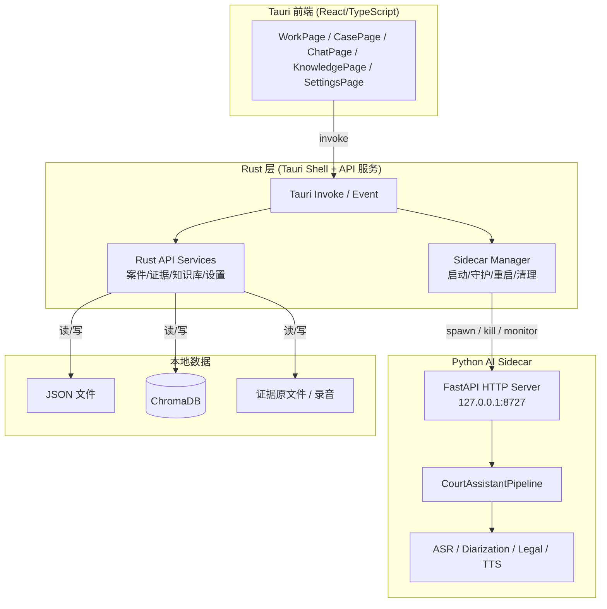

# Metascend 庭审助手 — 前后端统一技术规范

**版本：** 0.1.0  
**日期：** 2026-06-26  
**适用范围：** 前端（Tauri 2 + React/TypeScript）、Rust 桥接/API 层、Python AI 引擎

## 1. 设计目标与核心原则

本文档统一约定 Metascend 庭审助手前后端如何配合，解决当前“前端 UI 与 Python 后端脱节”的问题。核心目标：

1. **统一入口**：Tauri 前端只与 Rust 层交互，不直接调用 Python。
2. **速度优先**：先让现有 Python AI 引擎稳定可用，再逐步把纯数据操作迁移到 Rust。
3. **可靠性优先**：Rust 负责 Python sidecar 的启动、守护、重启、端口冲突处理、日志转发和退出清理。
4. **渐进式替换**：只有确认某个 AI 模型成为性能瓶颈时，才考虑用 Rust 原生实现替换它。

## 2. 总体架构



## 3. 职责分层

| 组件 | 负责 | 不负责 |
|---|---|---|
| **Tauri 前端** | 用户界面、状态展示、调用 Rust 命令 | 不直接调用 Python；不读写磁盘数据 |
| **Rust Sidecar Manager** | 启动 Python 进程、健康检查、自动重启、端口占用检测、日志转发、退出清理 | 不做模型推理；不直接处理业务数据 |
| **Rust API Services** | 案件、证据、知识库、设置等纯数据 API；直接读写本地 JSON/ChromaDB/文件 | 不做 AI 推理（Phase D 前） |
| **Python AI Engine** | `/status`、`/transcript`、`/suggestion`、`/calibrate` 等模型推理；法庭实时流水线 | 不管理自身进程生命周期；不直接处理案件/证据/知识库/设置的业务持久化 |

## 4. Python AI 引擎：作为 Rust 管理的 sidecar

### 4.1 运行形态

- Python 后端以 **sidecar** 形式运行，由 Rust 在应用启动时拉起。
- 启动命令：`uv run python -m src.api_server`
- 监听地址：`127.0.0.1:8727`
- 通信协议：HTTP（当前）/ 未来可替换为 Unix Domain Socket 或 stdio JSON-RPC

### 4.2 Python 端职责收窄

Python 后端仅保留与 AI 推理相关的端点：

| 端点 | 说明 |
|---|---|
| `GET /health` | 健康检查 |
| `GET /status` | 模型加载状态、实时状态 |
| `POST /courtroom/start` | 开始庭审 |
| `POST /courtroom/stop` | 停止庭审 |
| `GET /transcript` | 获取实时转写 |
| `GET /suggestion` | 获取法律建议 |
| `POST /calibrate` | 声纹角色校准 |
| `POST /chat/ask` | 庭后问答（可保留在 Python，也可迁移） |

以下端点逐步迁出 Python，由 Rust API Services 直接实现：

- `GET /cases`, `POST /cases`, `GET /cases/{id}`
- `GET /evidence`, `POST /evidence/import`, `DELETE /evidence/{name}`
- `GET /knowledge`, `POST /knowledge/search`
- `GET /settings`, `POST /settings`

## 5. Rust API 层逐步接管

### 5.1 迁移原则

- 只要是“纯数据操作”，优先由 Rust 直接读写本地存储，减少一次 IPC。
- 涉及模型推理或复杂音频/法律流水线的，保留在 Python。
- 每次迁移一个资源（cases → evidence → knowledge → settings），保持前端接口不变。

### 5.2 数据访问映射

| 资源 | 存储 | Rust 读写方式 |
|---|---|---|
| 案件（cases） | `data/cases/*.json` | `serde_json` + `tokio::fs` |
| 证据（evidence） | `data/evidence/` 原文件 + `data/evidence_index.json` | 文件系统 + JSON 索引 |
| 知识库（knowledge） | `data/knowledge_base/` 原文 + ChromaDB 向量 | `chromadb` 客户端或 HTTP |
| 设置（settings） | `data/runtime_settings.json` | `serde_json` + `tokio::fs` |
| 日志（logs） | `data/logs/` | Rust 统一收集后写入 |
| 模型缓存 | `~/.cache/metascend/models/` | Python AI Engine 使用，Rust 负责路径配置 |

### 5.3 前端接口保持不变

Rust 层对外暴露的 Tauri 命令名称和参数保持当前 `frontend/src-tauri/src/lib.rs` 中的定义，例如：

```rust
list_cases, create_case, get_case,
list_evidence, import_evidence, delete_evidence,
list_documents, search_documents,
get_settings, save_settings
```

实现方式从“转发给 Python HTTP”改为“Rust 本地处理”，前端无需改动。

## 6. Sidecar 生命周期管理

Rust `SidecarManager` 必须实现以下功能：

### 6.1 启动流程

1. 检测端口 `8727` 是否被占用。
2. 若被占用且是残留的本应用进程，先 kill 并等待释放。
3. 若被其他应用占用，尝试递增端口（`8728`、`8729`…）并通知前端。
4. 设置环境变量（如 `METASCEND_DATA_DIR`、`METASCEND_LOG_LEVEL`）。
5. 使用 `tokio::process::Command` 启动 `uv run python -m src.api_server`。
6. stdout/stderr 通过管道收集，转发到 Rust 日志系统和前端设置页“系统日志”区域。
7. 循环请求 `GET /health`，最多等待 10 秒，成功后通知前端。

### 6.2 健康检查与守护

- 每 5 秒请求一次 `/health`。
- 连续 3 次失败判定为异常。
- 异常时：
  - 先尝试 `SIGTERM` 优雅退出；
  - 等待 3 秒；
  - 若仍未退出则 `SIGKILL`；
  - 自动重新启动。

### 6.3 端口冲突处理

- 启动前使用 `tokio::net::TcpListener::bind("127.0.0.1:8727")` 探测。
- 若探测失败，读取 `lsof` / `netstat` 确认占用者。
- 占用者为同包名进程时，先清理；为其他进程时，端口递增。
- 端口变更后更新 `AppState.backend_url`，前端状态同步。

### 6.4 日志转发

- Python 侧日志通过 stderr/stdout JSON 行输出。
- Rust 解析后按级别写入：
  - `data/logs/rust_YYYY-MM-DD.log`
  - 前端 SettingsPage 的“系统日志”列表
- 日志包含时间戳、级别、模块、消息。

### 6.5 退出清理

- Tauri `RunEvent::ExitRequested` 时触发。
- 先停止 `CourtroomPipeline`（`POST /courtroom/stop`）。
- 再向 Python 进程发送 `SIGTERM`。
- 等待最多 5 秒，超时 `SIGKILL`。
- 释放端口、清理临时文件。

## 7. 数据所有权与存储

### 7.1 数据分层

| 类型 | 位置 | Owner |
|---|---|---|
| 案件元数据 | `data/cases/{case_id}.json` | Rust API Services |
| 证据原文件 | `data/evidence/{case_id}/{name}` | Rust API Services |
| 证据索引 | `data/evidence_index.json` | Rust API Services |
| 运行时设置 | `data/runtime_settings.json` | Rust API Services |
| 知识库原文 | `data/knowledge_base/{category}/` | Rust API Services |
| 知识库向量 | `data/knowledge_base/chroma/` | Rust API Services（通过 chromadb 客户端） |
| 加密日志 | `data/logs/session_*.enc` | Rust 统一收集，Python 可产生原始日志行 |
| 模型缓存 | `~/.cache/metascend/models/` | Python AI Engine（Rust 负责路径配置） |

### 7.2 Python 数据依赖

Python 仅读取案件/证据/知识库的内存副本用于推理，不直接写盘。需要时由 Rust 通过命令行参数或 HTTP 参数传入。

## 8. 错误处理与可观测性

### 8.1 错误分类

| 错误类型 | 处理方式 |
|---|---|
| Python sidecar 未启动 | Rust 自动重启，前端显示“后端启动中” |
| Python 健康检查失败 | 连续失败 3 次后重启，前端提示一次 |
| AI 推理超时 | 返回降级结果（如“[识别中]”或规则模板建议） |
| Rust 数据操作失败 | 返回明确错误码，前端显示中文提示 |
| 端口冲突 | 自动切换端口，日志记录 |

### 8.2 可观测性

- Rust 维护一个 `BackendHealth` 状态：`healthy`、`starting`、`restarting`、`error`。
- 前端每 5 秒轮询 `local_backend_status`。
- 关键事件通过 Tauri Event 推送到前端：
  - `backend:ready`
  - `backend:error`
  - `backend:restarting`
  - `transcript:new`
  - `suggestion:new`

## 9. 迁移路线图

### Phase A：Sidecar 稳定（当前 ~ 1 周）

目标：Rust 能可靠启动、守护、重启、清理 Python 后端。

- 实现 `SidecarManager`。
- 端口占用检测与自动递增。
- 日志转发到文件和前端。
- 退出清理。

### Phase B：纯数据 API 迁到 Rust（2~3 周）

按顺序迁移：

1. `cases`：案件 CRUD
2. `evidence`：证据导入/删除/列表
3. `settings`：运行时设置
4. `knowledge`：知识库列表与搜索（向量检索仍可调 Python 辅助，列表/元数据由 Rust 管理）

### Phase C：统一数据层（3~4 周）

- Rust 完全接管所有数据持久化。
- Python 仅在需要时通过参数接收案件上下文和知识库片段。
- 评估是否将 `chat/ask` 迁到 Rust 或保留在 Python。

### Phase D：AI 模型按需 Rust 化（未来）

仅在以下情况才考虑把单个模型替换为 Rust 原生实现：

- 该模型在 MacBook Air/Pro 上推理延迟持续 > 500ms，影响庭审实时性；
- 该模型内存占用持续 > 4GB，导致系统交换；
- 有成熟、许可证兼容的 Rust crate（如 `whisper-rs`、`candle`）可用；
- 替换后单测和端到端测试通过。

替换顺序建议：VAD → ASR → Embedding → Diarization → LLM。

## 10. 打包与部署

### 10.1 开发环境

- 源码根目录保留 `uv` 环境和 Python 源码。
- Rust 通过 `CARGO_MANIFEST_DIR` 的父目录定位项目根，启动 Python。

### 10.2 生产打包

- `.app` 内嵌 Python 解释器、依赖和模型缓存。
- 启动时使用 embedded Python 运行 `src.api_server`。
- 数据目录默认使用 `~/Library/Application Support/com.metascend.court-assistant/`。
- 首次启动引导用户完成模型下载或模型包释放。

### 10.3 权限

- 麦克风权限：`NSMicrophoneUsageDescription`。
- 文件访问：证据导入通过 Tauri Dialog API，避免沙盒问题。

## 11. 风险与例外

### 11.1 风险

| 风险 | 应对 |
|---|---|
| Rust 直接访问 ChromaDB 格式不兼容 | 先通过 ChromaDB HTTP 客户端访问，不直接解析底层文件 |
| Python 推理进程崩溃频繁 | Sidecar Manager 自动重启 + 崩溃计数器，超过阈值提示用户检查模型 |
| 前端接口变更 | 迁移时保持 Rust 命令签名不变，内部实现替换 |
| 生产包中 uv/Python 路径变化 | 打包脚本统一处理，Rust 启动时优先检测 embedded interpreter |

### 11.2 何时打破规则

- 如果某个数据操作需要复杂的 Python 逻辑（如 OCR 解析后的证据索引），可暂时保留 Python 端点，由 Rust 转发。
- 如果 Rust ChromaDB 客户端不成熟，知识库搜索可先保留 Python 端点，Rust 只管理元数据。
- 如果 Rust 原生模型在 PoC 中表现更优，可提前替换，但必须有单测和性能数据支撑。

## 12. 相关文件

- `frontend/src-tauri/src/lib.rs`：Rust 命令入口
- `src/api_server.py`：Python HTTP 服务
- `src/pipeline.py`：法庭实时流水线
- `src/case_archive/`、 `src/evidence/`、 `src/legal/knowledge_base.py`：待迁移的数据模块
- `docs/audit-report.md`：问题来源与当前状态
- `docs/architecture.md`：现有模块级架构
- `docs/api-interfaces.md`：模块间数据结构约定
