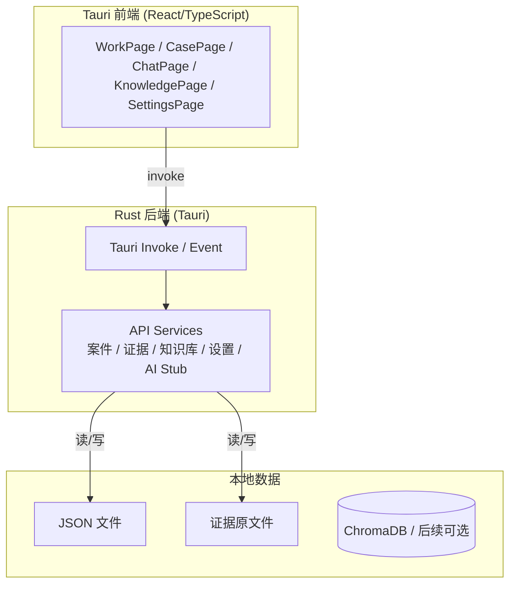

# Metascend 庭审助手 —— 全 Rust 后端技术规范

> 状态：Phase 1 已完成；Phase 2 进行中（已移除 Python sidecar，Rust 接管数据层，并接入真实庭审录音与本地 Whisper ASR 接口）

## 1. 目标与原则

- **后端完全 Rust 化**：所有业务 API、数据持久化、生命周期管理均在 Tauri 的 Rust 层完成，不再依赖 Python 运行时。
- **无 Python sidecar**：应用运行链路不再依赖 Python 后端；当前 Rust 层已直接承载案件、证据、知识库、设置、庭审录音与 ASR 接口。
- **本地优先**：数据仍保存在本地 JSON / 文件系统；后续 AI 能力通过 Rust 原生 crate / ONNX 实现，不再调用 Python 模型。
- **接口兼容**：前端 `invoke` 命令名称与返回结构尽量保持不变，AI 相关命令在实现前返回明确的“暂未实现”提示。

## 2. 总体架构

## 3. 职责分层

| 组件 | 负责 | 不负责 |
|---|---|---|
| Tauri 前端 | UI、状态、调用 Rust 命令 | 不直接读写磁盘 |
| Rust API Services | cases/evidence/knowledge/settings 的 CRUD；AI 命令 stub | 不做模型推理（Phase B 起逐步接入） |
| 本地文件系统 | 持久化所有业务数据 | 不处理业务逻辑 |

## 4. Rust 模块划分

| 模块 | 路径 | 职责 |
|---|---|---|
| `cases` | `frontend/src-tauri/src/cases.rs` | 案件 JSON 读写 |
| `evidence` | `frontend/src-tauri/src/evidence.rs` | 证据文件导入、列表、删除 |
| `knowledge` | `frontend/src-tauri/src/knowledge.rs` | 知识库文档元数据与内容读取 |
| `settings` | `frontend/src-tauri/src/store.rs` | 运行时设置持久化 |
| `ai_stub` | `frontend/src-tauri/src/ai_stub.rs` | 庭审控制、状态、校准与聊天命令，当前已接入真实录音/ASR 能力 |
| `audio` | `frontend/src-tauri/src/audio.rs` | 麦克风采集、实时录音缓冲、WAV 落盘 |
| `asr` | `frontend/src-tauri/src/asr.rs` | 本地 Whisper ASR 加载、重采样与转写 |
| `lib.rs` | `frontend/src-tauri/src/lib.rs` | Tauri 命令注册、状态管理、生命周期 |

## 5. AI 功能迁移路线图

> 当前 Phase A 已删除 Python 后端，AI 接口保留但返回降级结果。

| 阶段 | 目标 | 候选 Rust 方案 |
|---|---|---|
| Phase A | Rust 接管数据 API；AI 命令 stub | — |
| Phase B | 音频采集 + 转写入口 | `cpal` + `whisper-rs`（已完成接入） |
| Phase C | 说话人分离 / VAD / 录音增强 | `pyannote-rs` / ONNX / 后续优化 |
| Phase D | 法律策略 / RAG | `ort` + 本地 embedding + 规则引擎 |
| Phase E | TTS | `piper-rs` / `ort` |

## 6. 数据 ownership

| 资源 | 存储位置 | 访问方式 |
|---|---|---|
| cases | `app_data_dir/cases/{case_id}.json` | `serde_json` + `tokio::fs` |
| evidence | `app_data_dir/evidence/` | `tokio::fs` |
| knowledge | `project_root/data/knowledge_base/` | `tokio::fs` |
| settings | `app_data_dir/settings.json` | `serde_json` |

## 7. 错误处理与可观测性

- Rust 命令统一返回 `Result<Value, String>`。
- AI stub 返回 `{"ok": false, "message": "..."}` 或等价的空结果，前端按降级提示展示。
- 使用 `tauri::async_runtime` 处理异步 IO，避免阻塞主线程。

## 8. 打包与部署

- 开发：`cd frontend && npm run dev` / `cargo tauri dev`。
- 生产：`CI=true npm run tauri build`。
- 不再内嵌 Python、uv、模型缓存；应用包仅包含 Rust 二进制与前端资源。

## 9. 当前实施状态

- 已删除应用运行链路中的 Python sidecar 依赖。
- 已新增 Rust 麦克风录音、WAV 持久化、本地 Whisper ASR 接口。
- 前端庭审辅助页已接入真实录音控制、ASR 加载与转写触发。
- 后续仍需继续优化说话人分离、法律策略推理、录音 VAD 与 UI 细节。

## 10. 风险与例外

- 用户已有 `data/` 中的案件、证据、知识库文件继续保留，Rust 数据层使用相同 JSON 结构，兼容旧数据。
- 若后续需要 ChromaDB 向量搜索，优先考虑 Rust HTTP 客户端访问本地 Chroma 服务，或直接维护向量索引。
- 庭审录音与转写入口已可用；说话人分离、法律策略与 TTS 仍需后续阶段补齐。
